# Migrating from @material-ui to @mui

Nowadays well-known @material-ui is a legacy package, and all it's components were migrated to new @mui package. Previous is no longer maintainable, and new components appear only in @mui. So, it's reasonable question for everyone: How to migrate to the new package?

I have an answer) Of course, my thoughts were, that process shouldn't be as complex, because this is a routine for thousands of developers. Also, mui-team wrote some instructions for migrations [here](https://mui.com/material-ui/guides/migration-v4/#types-property-quot-palette-quot-quot-spacing-quot-does-not-exist-on-type-defaulttheme) and [here](https://mui.com/material-ui/guides/migration-v3/). They works well if to follow, but with case, when you often use such construction as `makeStyles/withStyles` around your project and use redefined commercial theme (as [minimal.cc](https://minimals.cc/) in my case), you may encounter some difficulties. That's my story down below...

### No more `makeStyles` available

In a few words, developers decided to use `styled` lib in basement, and marked previous systems with `classes` and `makeStyles` as legacy. Of course, this method have a lot of advantages, but if you have a lot of usages of legacy code, you need make them to work, at least.

Thanks for developers team, they left a loophole for using legacy. Package [@mui/styles](https://mui.com/system/styles/basics/) should help.

The biggest trap is that definition for `makeStyles` is still available in `@mui/material`, but it returns some kind of shit with `never` type and looks more like a stub.

Here pictures about what I mean:

## Your bro makeStyles

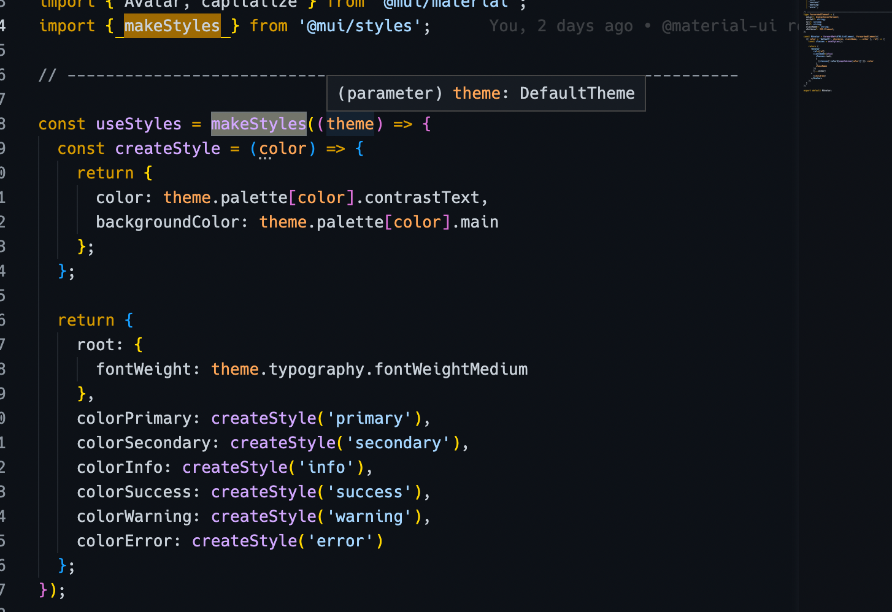

## Not your bro @mui/material/styles.makeStyles, returning never

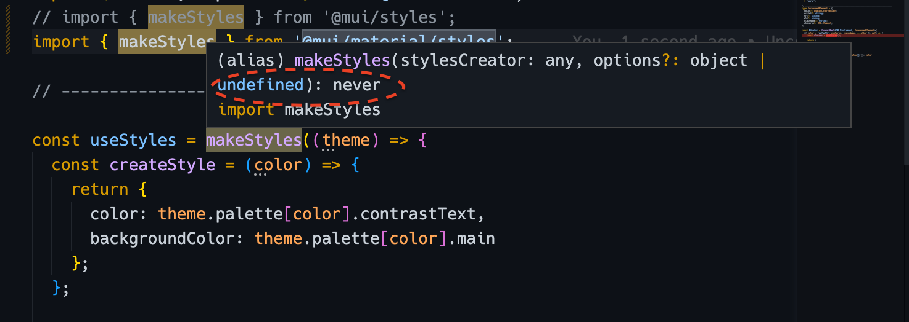

So, in components you should use `makeStyles` only from `@mui/styles` after migration, this is the rule!

### Connecting theme overrides for material

Guide about redefining of material components available [here](https://mui.com/material-ui/customization/theming/) and very simple. But, of course, with legacy - it is not as simple as in case using `styled`.

As answers that I googled said, I should just replace some basic constructions with theme overrides attachments like that:
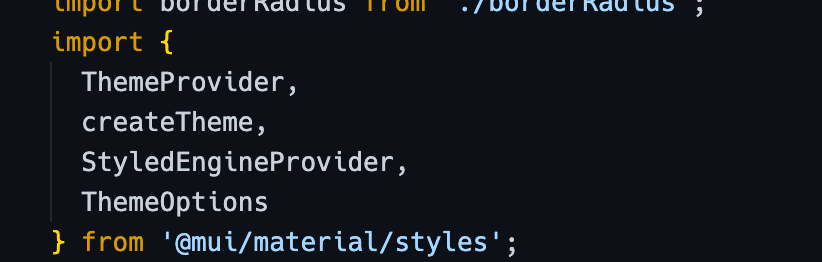

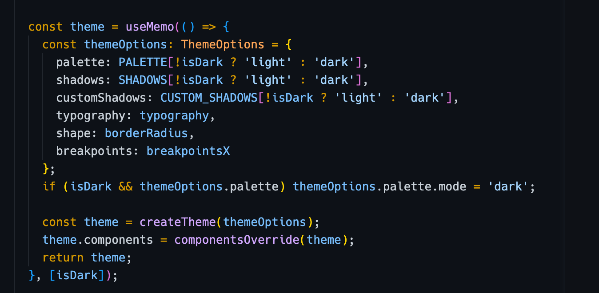

And use it like so:
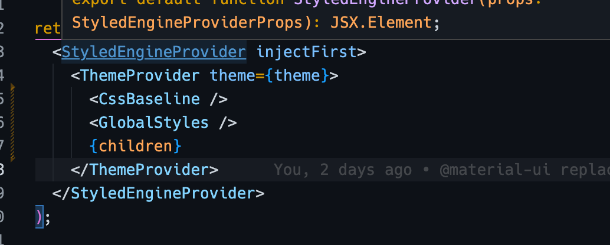

And, as you remember, in components I should use only `makeStyles` from `@mui/styles`. And thats the problem - looks like those packages not synchronized, and in this case I get styles overrides components on theme level (with `createTheme`), but in `makeStyles` I get `theme` as empty object, and I can't use any utilities or patterns or whatever:

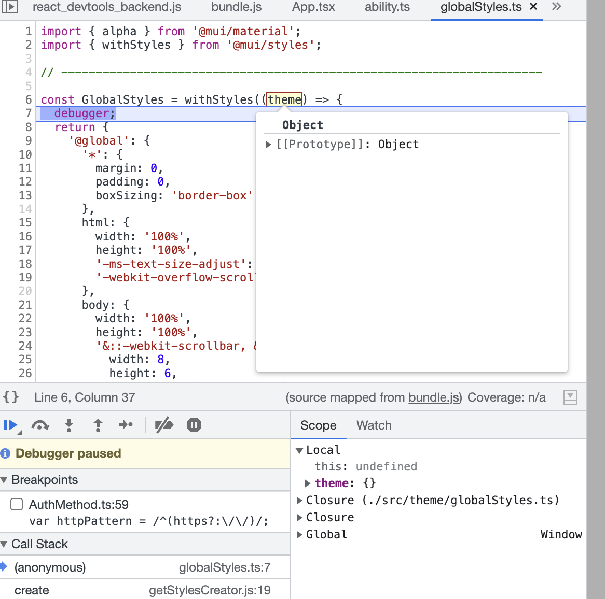

And I get not cached exceptions and non working project at all. And it makes me sad.

But we have an ability to import `ThemeProvider` from `@mui/styles` also, and in this case I got correct `theme` variable with all what I need in `withStyles` of component, but, unfortunately, I lost all my basic themes overrides:
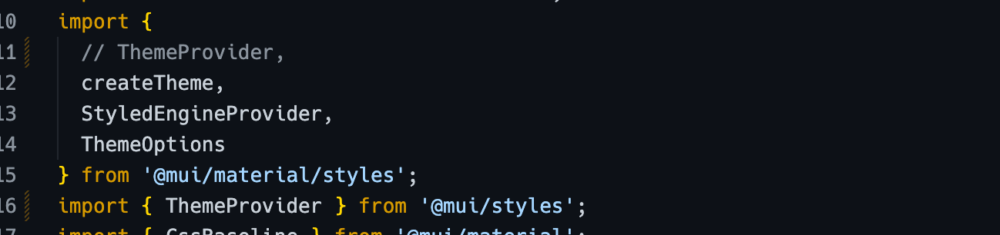

### Default button without any styles, that indicates that i lost all theme overrides :(

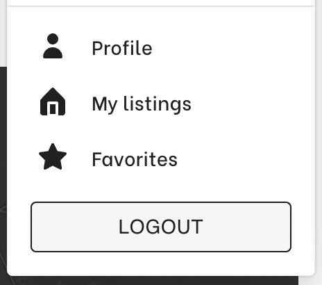

### But look what I got instead :)

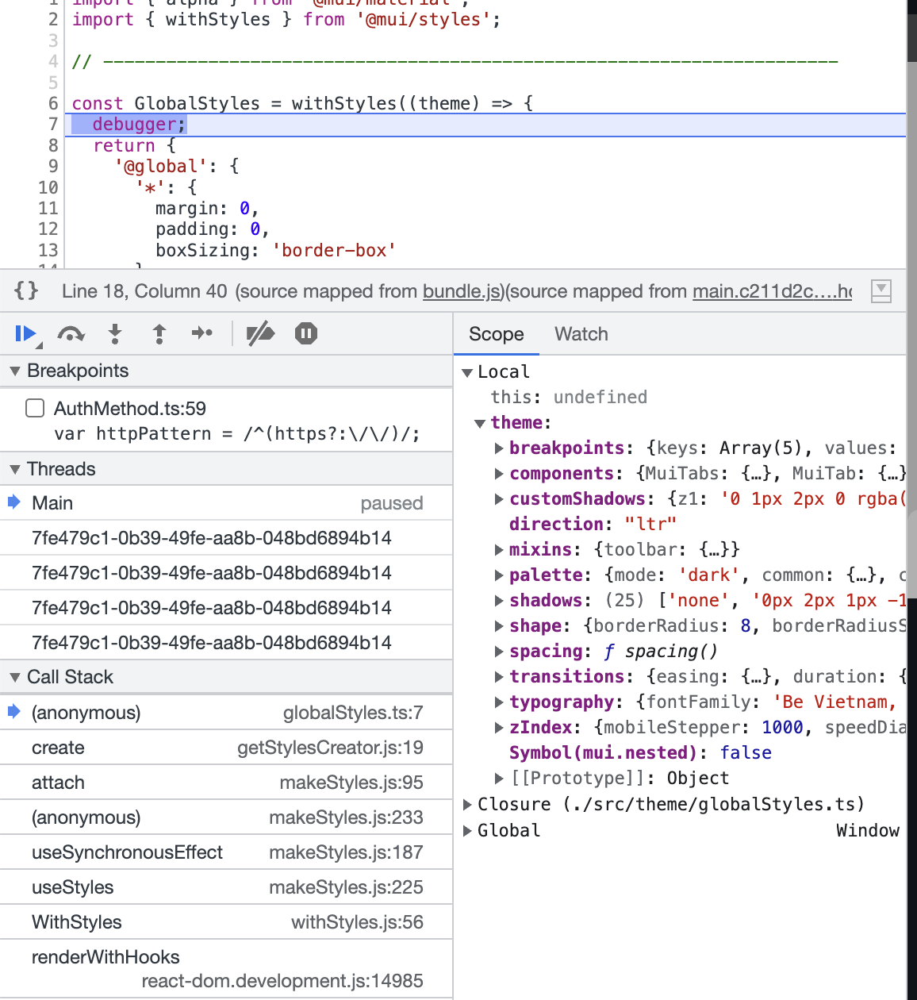

### Final

So, the only decision that I've found is to use both of `ThemeProvider` like so:

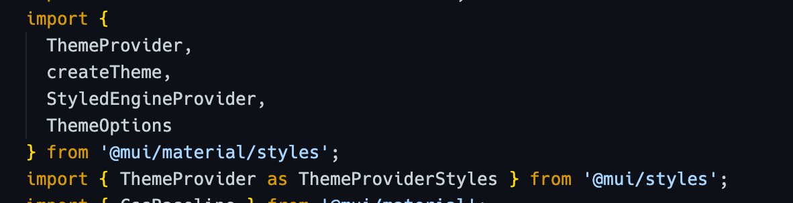

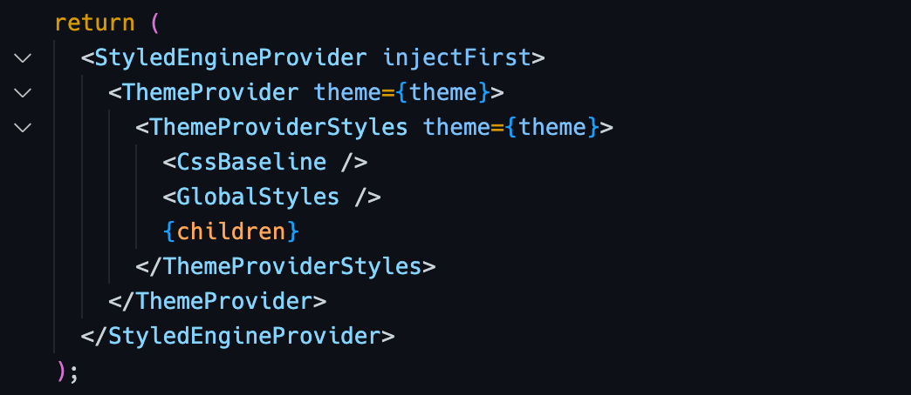

Everything works fine, in future, you can use both methods of components decorations, but I would prefer to use `styled` as common one. And, of course, after all those manipulations you can remove outdated package `@material-ui` from your project. You are awesome :)
